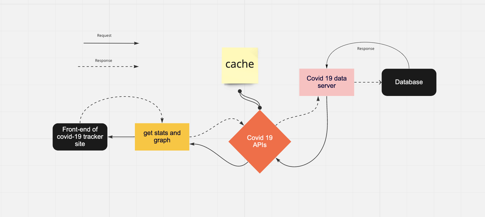

# Software Requirements

## Vision

Minimum Length: 3-5 sentences
We want to create an app where a user can save a profile using their unique credentials. The app will have the ability to save cities and render data via a graph or chart upon logging in. This will provide pertinent data about COVID-19 and the user will be more informed in their cities COVID rates as well as other cities of interest. 

### Scope (In/Out)
IN - What will your product do?
User will be able to login using unique credentials
User will be able to save cities to their profile
User will be able to delete saved cities
User will be able to view COVID-19 data upon logging in

OUT - What will your product not do?
The product will not 
## Minimum Viable Product vs
What will your MVP functionality be?
Ability to render data via graph or table on a saved city
What are your stretch goals?
Flight tracker
TBD
Stretch
What stretch goals are you going to aim for?
Flight tracker information so that user can plan for flights based on COVID data.
Functional Requirements
List the functionality of your product. This will consist of tasks such as the following:
A user will be able to login using Auth0
A user will be able to save multiple cities to profile
Data will populate upon logging on
## Data Flow
User will be able to request data from COVID-19 API. There the query will pull from their database of pertinent information. Cache will save data as it passes through API into the local server. Data will be rendered on the front end through a graph. 

## Non-Functional Requirements (301 & 401 only)
Non-functional requirements are requirements that are not directly related to the functionality of the application but still important to the app

Security - Auth0
Usability - CRUD
